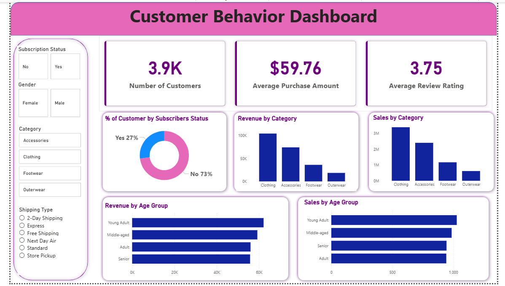

# customer_behavior_analysis
data analytic project showcasing customer behavior analysis using Python ,Sql and Power BI.

# 📌 Project Overview
The goal of this project is to simulate a corporate-grade end-to-end data analytics workflow, demonstrating the ability to translate raw data into strategic business intelligence by:

✅ Data Preparation,Modeling & Exploratory Data Analysis (Python): Clean and transform the raw dataset for analysis.

✅ Data Analysis (SQL): Simulate business transactions, and run queries to extract insights on customer segments, loyalty, and purchase drivers.

✅ Visualization & Insights (Power BI): Build an interactive dashboard that highlights key patterns and trends, enabling stakeholders to make data-driven decisions.

✅ Report and Presentation: Write a clear project report summarizing your key findings and business recommendations. Prepare a presentation that visually communicates insights and actionable recommendations to stakeholders.

# 🛠 Tools & Technologies Used
### 1.Python (Data Analysis & Cleaning)

✅Pandas
✅NumPy
✅Matplotlib / Seaborn

### 2.SQL

✅PostgreSQL Server

### 3.Power BI

✅Interactive Dashboard

### 4.Gamma

✅Presentation (PPT)

 ### 5.Jupyter Notebook

###  6.GitHub (Version Control)

# 🔍 Project Workflow / Steps

#### 1.Data Loading

-> Loaded the dataset using Python (Pandas).

-> Checked data structure, columns, and data types.

#### 2.Exploratory Data Analysis (EDA)

-> Analyzed distributions, trends, and patterns.

-> Identified missing values, outliers, and inconsistencies.

-> Visualized key insights using charts and graphs.

#### 3.Data Cleaning

-> Handled missing and duplicate values.

-> Corrected data types.

-> Prepared clean data for SQL and visualization.

#### 4.SQL Analysis (PostgreSQL)

-> Imported cleaned data into PostgreSQL.

-> Wrote SQL queries for:

a. Aggregations

b. Filtering

c. Joins

d. Business-specific insights

 #### 5.Dashboard Creation (Power BI)

-> Connected Power BI to PostgreSQL.

-> Built interactive dashboards with filters and KPIs.

-> Visualized trends and performance metrics.

#### 6.Reporting

-> Created a structured analysis report summarizing:

-> Key findings

-> Insights

-> Business recommendations

#### 7.Presentation (Gamma)

-> Designed a professional PPT.

-> Explained problem statement, approach, insights, and outcomes.

# 📈 Power BI Dashboard

-> Interactive visuals and KPIs

-> Filters for deep-dive analysis

-> User-friendly and decision-oriented design

# ✅ Key Results & Insights

-> Identified major trends and patterns in the data

-> Highlighted performance metrics and problem areas

-> Provided data-driven recommendations for better decision-making

# ▶️ How to Run This Project

1. Clone the repository

git clone <[repository-link](https://github.com/riyaverma09/customer_behavior_analysis.git)>

2. Install required Python libraries

pip install pandas numpy matplotlib seaborn

3. Run the Jupyter Notebook for EDA and data cleaning.

4. Load the cleaned dataset into PostgreSQL Server.

5. Execute SQL queries provided in the SQL folder.

6. Open the Power BI file (.pbix) to explore the dashboard.

7. View the Gamma PPT and report for final insights.

# 📌 Conclusion

This project showcases practical skills in ***data analysis, SQL querying, dashboard building, and storytelling with data.*** It reflects a real-world analytics workflow suitable for business and decision-making scenarios.
